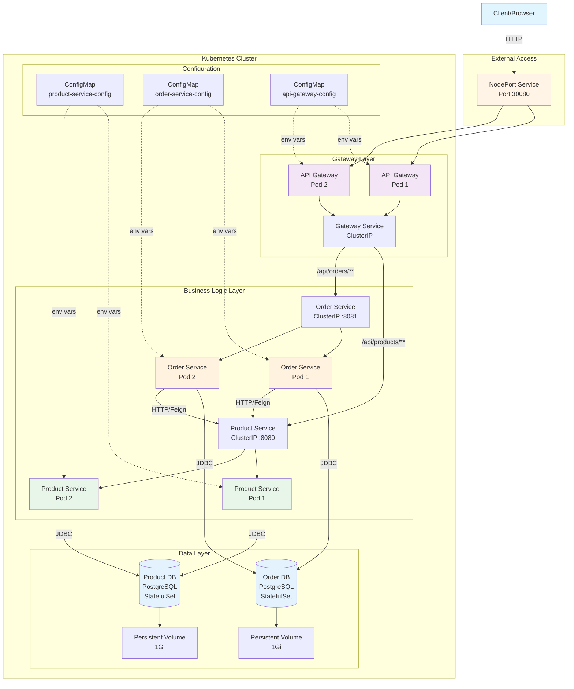
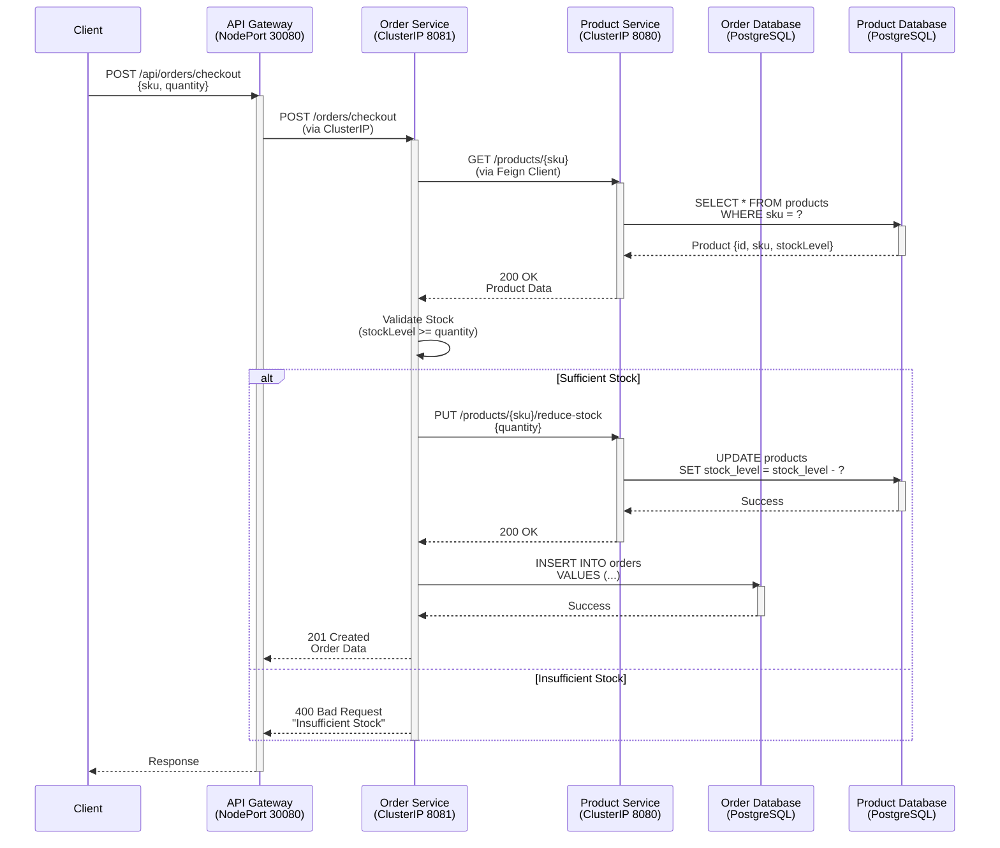

# E-Commerce Microservices Architecture

This document provides detailed architecture diagrams and explanations for the E-Commerce microservices application.

---

## Table of Contents
1. [System Overview](#system-overview)
2. [Kubernetes Architecture](#kubernetes-architecture)
3. [Service Communication Flow](#service-communication-flow)
4. [Database Architecture](#database-architecture)
5. [Deployment Architecture](#deployment-architecture)
6. [Design Patterns](#design-patterns)

---

## System Overview

### High-Level Architecture



---

## Kubernetes Architecture

### Component Overview

```
┌─────────────────────────────────────────────────────────────────┐
│                     Kubernetes Cluster                          │
│                                                                 │
│  ┌────────────────┐        ┌────────────────┐                  │
│  │   ConfigMaps   │        │   Deployments  │                  │
│  ├────────────────┤        ├────────────────┤                  │
│  │ • product-svc  │        │ • api-gateway  │ (2 replicas)     │
│  │ • order-svc    │        │ • product-svc  │ (2 replicas)     │
│  │ • api-gateway  │        │ • order-svc    │ (2 replicas)     │
│  └────────────────┘        └────────────────┘                  │
│                                                                 │
│  ┌────────────────┐        ┌────────────────┐                  │
│  │  StatefulSets  │        │    Services    │                  │
│  ├────────────────┤        ├────────────────┤                  │
│  │ • product-db   │        │ • api-gateway  │ (NodePort 30080) │
│  │ • order-db     │        │ • product-svc  │ (ClusterIP 8080) │
│  └────────────────┘        │ • order-svc    │ (ClusterIP 8081) │
│                            │ • product-db   │ (Headless 5432)  │
│  ┌────────────────┐        │ • order-db     │ (Headless 5432)  │
│  │      PVCs      │        └────────────────┘                  │
│  ├────────────────┤                                            │
│  │ • product-db-0 │ (1Gi)                                      │
│  │ • order-db-0   │ (1Gi)                                      │
│  └────────────────┘                                            │
└─────────────────────────────────────────────────────────────────┘
```

### Resource Specifications

| Resource Type | Name | Replicas | CPU Request | Memory Request | CPU Limit | Memory Limit |
|--------------|------|----------|-------------|----------------|-----------|--------------|
| **Deployment** | api-gateway | 2 | 250m | 512Mi | 500m | 1Gi |
| **Deployment** | product-service | 2 | 250m | 512Mi | 500m | 1Gi |
| **Deployment** | order-service | 2 | 250m | 512Mi | 500m | 1Gi |
| **StatefulSet** | product-db | 1 | 250m | 256Mi | 500m | 512Mi |
| **StatefulSet** | order-db | 1 | 250m | 256Mi | 500m | 512Mi |

---

## Service Communication Flow

### Complete Request Flow: Create Order



### DNS Resolution in Kubernetes

```
┌──────────────────────────────────────────────────────────┐
│  Order Service Pod wants to call Product Service         │
└──────────────────────────────────────────────────────────┘
                           │
                           ▼
          ┌────────────────────────────────┐
          │ DNS Query: product-service     │
          └────────────────────────────────┘
                           │
                           ▼
          ┌────────────────────────────────┐
          │  Kubernetes DNS Server         │
          │  (kube-dns / CoreDNS)          │
          └────────────────────────────────┘
                           │
                           ▼
          ┌────────────────────────────────┐
          │ Resolves to:                   │
          │ product-service.default.svc    │
          │ .cluster.local                 │
          │ → ClusterIP: 10.100.171.130    │
          └────────────────────────────────┘
                           │
                           ▼
          ┌────────────────────────────────┐
          │  Service Load Balancer         │
          │  (kube-proxy)                  │
          └────────────────────────────────┘
                           │
                ┌──────────┴──────────┐
                ▼                     ▼
    ┌──────────────────┐  ┌──────────────────┐
    │ Product Pod 1    │  │ Product Pod 2    │
    │ 10.244.0.5:8080  │  │ 10.244.0.6:8080  │
    └──────────────────┘  └──────────────────┘
```

---

## Database Architecture

### Database-per-Service Pattern

```
┌─────────────────────────────────────────────────────────┐
│              Database-per-Service Pattern                │
└─────────────────────────────────────────────────────────┘

┌──────────────────────┐         ┌──────────────────────┐
│  Product Service     │         │   Order Service      │
├──────────────────────┤         ├──────────────────────┤
│ • Manages Products   │         │ • Manages Orders     │
│ • Inventory Control  │         │ • Order Processing   │
│ • Stock Management   │         │ • Customer Orders    │
└──────────┬───────────┘         └──────────┬───────────┘
           │                                │
           │ Exclusive Access               │ Exclusive Access
           │                                │
           ▼                                ▼
┌──────────────────────┐         ┌──────────────────────┐
│   Product Database   │         │    Order Database    │
├──────────────────────┤         ├──────────────────────┤
│ Tables:              │         │ Tables:              │
│ • products           │         │ • orders             │
│   - id               │         │   - id               │
│   - sku              │         │   - ref_number       │
│   - name             │         │   - customer_id      │
│   - price            │         │   - total_amount     │
│   - stock_level      │         │ • order_items        │
│   - created_at       │         │   - order_id         │
│                      │         │   - sku              │
│ PostgreSQL 15        │         │   - quantity         │
│ StatefulSet          │         │                      │
│ Persistent Volume    │         │ PostgreSQL 15        │
└──────────────────────┘         │ StatefulSet          │
                                 │ Persistent Volume    │
                                 └──────────────────────┘

Key Principles:
✓ Each service owns its database
✓ No direct cross-database queries
✓ Inter-service communication via APIs
✓ Independent scaling and deployment
✓ Data encapsulation and autonomy
```

### Data Consistency Pattern

```
                Order Creation Flow
                        │
                        ▼
        ┌───────────────────────────┐
        │  1. Check Product Stock   │
        │     (GET request)         │
        └───────────────────────────┘
                        │
                        ▼
        ┌───────────────────────────┐
        │  2. Validate Quantity     │
        │     (Business Logic)      │
        └───────────────────────────┘
                        │
                        ▼
        ┌───────────────────────────┐
        │  3. Reduce Stock          │
        │     (PUT request)         │
        │     [Atomic Operation]    │
        └───────────────────────────┘
                        │
                        ▼
        ┌───────────────────────────┐
        │  4. Create Order          │
        │     (INSERT to Order DB)  │
        └───────────────────────────┘
                        │
                        ▼
        ┌───────────────────────────┐
        │  5. Return Order Details  │
        └───────────────────────────┘

Note: In production, use Saga pattern or
distributed transactions (2PC) for better
consistency guarantees.
```

---

## Deployment Architecture

### Kubernetes Deployment Layers

```
┌─────────────────────────────────────────────────────────────┐
│                   EXTERNAL ACCESS LAYER                     │
├─────────────────────────────────────────────────────────────┤
│                                                             │
│  Internet → Minikube IP (192.168.49.2) → NodePort (30080)  │
│                                                             │
└─────────────────────────────────────────────────────────────┘
                              │
                              ▼
┌─────────────────────────────────────────────────────────────┐
│                   INGRESS/GATEWAY LAYER                     │
├─────────────────────────────────────────────────────────────┤
│                                                             │
│  ┌──────────────────┐      ┌──────────────────┐            │
│  │  API Gateway     │      │  API Gateway     │            │
│  │  Pod 1           │      │  Pod 2           │            │
│  └──────────────────┘      └──────────────────┘            │
│           │                         │                      │
│           └─────────┬───────────────┘                      │
│                     │                                      │
│         ┌───────────▼──────────┐                          │
│         │ Gateway Service      │                          │
│         │ (ClusterIP)          │                          │
│         └──────────────────────┘                          │
│                     │                                      │
└─────────────────────┼───────────────────────────────────────┘
                      │
         ┌────────────┴────────────┐
         │                         │
         ▼                         ▼
┌─────────────────────┐   ┌─────────────────────┐
│  BUSINESS SERVICES  │   │  BUSINESS SERVICES  │
├─────────────────────┤   ├─────────────────────┤
│                     │   │                     │
│ Product Service     │   │  Order Service      │
│ ┌─────┐  ┌─────┐   │   │ ┌─────┐  ┌─────┐   │
│ │Pod 1│  │Pod 2│   │   │ │Pod 1│  │Pod 2│   │
│ └─────┘  └─────┘   │   │ └─────┘  └─────┘   │
│      │      │       │   │      │      │       │
│      └──────┼───┐   │   │      └──────┼───┐   │
│             │   │   │   │             │   │   │
│      ┌──────▼───▼─┐ │   │      ┌──────▼───▼─┐ │
│      │  Service   │ │   │      │  Service   │ │
│      │ (ClusterIP)│ │   │      │ (ClusterIP)│ │
│      └────────────┘ │   │      └────────────┘ │
└──────────┬──────────┘   └──────────┬──────────┘
           │                         │
           │                         │
           ▼                         ▼
┌─────────────────────┐   ┌─────────────────────┐
│    DATABASE LAYER   │   │    DATABASE LAYER   │
├─────────────────────┤   ├─────────────────────┤
│                     │   │                     │
│  Product DB         │   │  Order DB           │
│  ┌──────────────┐   │   │  ┌──────────────┐   │
│  │ StatefulSet  │   │   │  │ StatefulSet  │   │
│  │   Pod 0      │   │   │  │   Pod 0      │   │
│  └──────────────┘   │   │  └──────────────┘   │
│         │           │   │         │           │
│         ▼           │   │         ▼           │
│  ┌──────────────┐   │   │  ┌──────────────┐   │
│  │ Persistent   │   │   │  │ Persistent   │   │
│  │ Volume (1Gi) │   │   │  │ Volume (1Gi) │   │
│  └──────────────┘   │   │  └──────────────┘   │
└─────────────────────┘   └─────────────────────┘
```

### Rolling Update Strategy

```
Initial State: Version 1.0 (2 pods)
┌────────┐  ┌────────┐
│ Pod 1  │  │ Pod 2  │
│ v1.0   │  │ v1.0   │
└────────┘  └────────┘

Step 1: Create new pod (maxSurge: 1)
┌────────┐  ┌────────┐  ┌────────┐
│ Pod 1  │  │ Pod 2  │  │ Pod 3  │
│ v1.0   │  │ v1.0   │  │ v2.0   │
└────────┘  └────────┘  └────────┘
                        ↑ Starting...

Step 2: New pod ready, terminate old pod
┌────────┐  ┌────────┐  ┌────────┐
│ Pod 1  │  │ Pod 2  │  │ Pod 3  │
│ v1.0   │  │ v1.0   │  │ v2.0   │
│Terminating                Ready │
└────────┘  └────────┘  └────────┘

Step 3: Create another new pod
            ┌────────┐  ┌────────┐  ┌────────┐
            │ Pod 2  │  │ Pod 3  │  │ Pod 4  │
            │ v1.0   │  │ v2.0   │  │ v2.0   │
            └────────┘  └────────┘  └────────┘
                                    ↑ Starting...

Step 4: Complete - Version 2.0 (2 pods)
                    ┌────────┐  ┌────────┐
                    │ Pod 3  │  │ Pod 4  │
                    │ v2.0   │  │ v2.0   │
                    └────────┘  └────────┘

✓ Zero downtime achieved
✓ maxUnavailable: 0 (always 2 pods available)
✓ maxSurge: 1 (max 3 pods during update)
```

---

## Design Patterns

### 1. API Gateway Pattern

**Purpose**: Single entry point for all client requests

```
Benefits:
• Simplifies client code
• Centralized authentication/authorization
• Request routing and composition
• Protocol translation
• Rate limiting and throttling

Implementation:
• Spring Cloud Gateway
• Reactive (non-blocking)
• Route-based forwarding
• Load balancing via service discovery
```

### 2. Database-per-Service Pattern

**Purpose**: Each microservice has its own database

```
Benefits:
• Loose coupling
• Independent scaling
• Technology heterogeneity
• Fault isolation

Challenges:
• Data consistency (eventual consistency)
• Cross-service queries
• Distributed transactions
```

### 3. Service Discovery Pattern

**Purpose**: Services find each other dynamically

```
Implementation:
• Kubernetes DNS
• Service names resolve to ClusterIP
• Automatic load balancing
• Health-check based routing

Example:
order-service → http://product-service:8080
(DNS resolves to ClusterIP → Load balances to pods)
```

### 4. Externalized Configuration Pattern

**Purpose**: Configuration separate from code

```
Implementation:
• Kubernetes ConfigMaps
• Environment-specific configurations
• No image rebuild for config changes
• Centralized management

Example ConfigMap:
apiVersion: v1
kind: ConfigMap
metadata:
  name: product-service-config
data:
  SPRING_DATASOURCE_URL: "jdbc:postgresql://product-db:5432/productdb"
  LOGGING_LEVEL_ROOT: "INFO"
```

### 5. Health Check Pattern

**Purpose**: Monitor service availability

```
Implementation:
• Liveness Probe: Is the service alive?
• Readiness Probe: Can it handle traffic?
• Startup Probe: Has it finished starting?

Kubernetes Actions:
• Liveness failure → Restart pod
• Readiness failure → Remove from service endpoints
• Startup failure → Give more time before checking liveness
```

---

## Scalability Considerations

### Horizontal Scaling

```
Current: 2 replicas per service
Can scale to: kubectl scale deployment product-service --replicas=10

Benefits:
• Increased throughput
• Better fault tolerance
• Load distribution

Kubernetes handles:
• Load balancing across pods
• Health monitoring
• Automatic rescheduling
```

### Database Scalability

```
Current: Single PostgreSQL instance per service
Future options:
• Read replicas for read-heavy workloads
• Database sharding for data partitioning
• Managed database services (AWS RDS, Cloud SQL)
```

---

## Security Considerations

### Current Implementation (Lab Environment)

```
⚠️  For Educational Purposes Only:
• Plain text passwords in ConfigMaps
• No authentication/authorization
• No TLS/SSL encryption
• No network policies
```

### Production Recommendations

```
✓ Use Kubernetes Secrets for sensitive data
✓ Implement JWT-based authentication
✓ Enable TLS for all communications
✓ Implement Network Policies
✓ Use RBAC for Kubernetes access
✓ Enable database encryption at rest
✓ Implement API rate limiting
✓ Add input validation and sanitization
```

---

## Monitoring and Observability

### Health Endpoints

```
All services expose Spring Boot Actuator:
• /actuator/health - Health status
• /actuator/info - Service information
• /actuator/metrics - Prometheus metrics

Future additions:
• Distributed tracing (Jaeger/Zipkin)
• Centralized logging (ELK Stack)
• Metrics visualization (Grafana)
```

---

## Technology Stack

| Layer | Technology | Version | Purpose |
|-------|-----------|---------|---------|
| **Language** | Java | 17 | Application development |
| **Framework** | Spring Boot | 3.3.2 | Microservices framework |
| **API Gateway** | Spring Cloud Gateway | 4.1.4 | Request routing |
| **Database** | PostgreSQL | 15-alpine | Data persistence |
| **Container** | Docker | Latest | Application packaging |
| **Orchestration** | Kubernetes | Latest | Container orchestration |
| **HTTP Client** | OpenFeign | 4.1.2 | Inter-service communication |
| **Build Tool** | Maven | 3.9 | Dependency management |

---

## Future Enhancements

1. **Service Mesh** (Istio/Linkerd)
   - Advanced traffic management
   - Mutual TLS
   - Observability

2. **Message Queue** (RabbitMQ/Kafka)
   - Asynchronous communication
   - Event-driven architecture
   - Better decoupling

3. **Circuit Breaker** (Resilience4j)
   - Fault tolerance
   - Fallback mechanisms
   - Bulkhead pattern

4. **Caching** (Redis)
   - Reduce database load
   - Improve response times
   - Session management

5. **API Documentation** (Swagger/OpenAPI)
   - Interactive API docs
   - Client code generation
   - Contract testing

---

**Document Version**: 1.0
**Last Updated**: 2025-11-13
**Course**: Distributed Systems (COMP41720)
